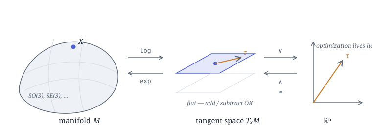

# Lie Theory：面向优化与机器人的直观入门

<div class="ln-byline">2026-08-06 · 阅读约 7 分钟 · Yufeng Jin</div>

<p class="ln-lead" markdown>Lie theory 是把旋转、位姿这类"弯曲空间"上的优化搬回普通向量微积分的通用语言。这篇从 manifold、tangent space 讲到 hat/vee 与 exp/log，合成 manifold 上的一步优化，最后给出手写 $SO(3)$ 的代码小样。</p>

!!! abstract "一句话导览"
    **Lie group** 是一个"光滑弯曲"的空间，里面装着代表 transformation 的元素（旋转、位姿等）。
    麻烦在于：**你没法在弯曲空间上直接做加减、求梯度**。
    解决办法是在三个空间之间来回搬：

    $$
    \underbrace{\mathcal{M}}_{\text{弯曲 manifold}}
    \;\xrightleftharpoons[\ \exp\ ]{\ \log\ }\;
    \underbrace{\mathfrak{m}}_{\text{tangent space / Lie algebra}}
    \;\xrightleftharpoons[\ (\cdot)^\wedge\ ]{\ (\cdot)^\vee\ }\;
    \underbrace{\mathbb{R}^n}_{\text{普通向量工作区}}
    $$

    把元素 **log** 到平直的 tangent space，在同构的 $\mathbb{R}^n$ 里像往常一样做优化，再 **exp** 回到 manifold。全篇都在讲这一张图。

> 学习笔记，源自 Aalok Patwardhan 的 [*A Visual Introduction to Lie Theory*](https://aalok.uk/projects/lietheory/)<sup>[[1]](#refs)</sup>，并补上了具体推导与代码。

---

<div class="ln-eyebrow">预备知识</div>

## 预备知识

正文将反复用到下面几个概念，每个写成「中文名 = 英文名 = 最小定义」三元组：

- **流形 = manifold** = 一个光滑弯曲的空间，局部看起来像平直的 $\mathbb{R}^n$、整体是弯的。<sup>[[2]](#refs)</sup>
- **李群 = Lie group** = 既是 manifold、群运算（矩阵乘法与求逆）又光滑的对象。<sup>[[4]](#refs)</sup>
- **切空间 = tangent space** = 贴在 manifold 某一点处的平直切平面。<sup>[[2]](#refs)</sup>
- **李代数 = Lie algebra** = Lie group 在单位元处的那张特殊 tangent space（旋转群的记作 $\mathfrak{so}(n)$）。<sup>[[2]](#refs)</sup>
- **反对称矩阵 = skew-symmetric matrix** = 满足 $A^\top=-A$ 的矩阵；旋转群的 Lie algebra 元素恰好取这种形式。<sup>[[2]](#refs)</sup>
- **指数映射 / 对数映射 = exponential map / logarithm map** = 在 tangent space 与 manifold 之间往返的一对互逆映射；对旋转就是矩阵指数 / 矩阵对数。<sup>[[4]](#refs)</sup>

---

<div class="ln-eyebrow">问题 01 · 起点</div>

## 1. 回顾：欧氏空间里的优化

先看"一切都很顺"的情形。给定 cost function $f:\mathbb{R}^n\to\mathbb{R}$，我们想找让它最小的 $\mathbf{x}$。gradient descent 的套路是：

1. **perturb**：在 $\mathbf{x}$ 附近扰动一点点；
2. **gradient**：算出 $\nabla f(\mathbf{x})$，它指向上升最快的方向；
3. **step**：沿 $-\nabla f$ 走一小步。

$$
\mathbf{x}_{k+1} = \mathbf{x}_k - \alpha\,\nabla f(\mathbf{x}_k)
$$

这里的关键前提是：**$\mathbf{x}$ 是一个自由的 vector**。它的每个分量都可以独立地加上一个小量 $\delta$，加完仍然是合法的输入。$\mathbb{R}^n$ 是"平的"，加法自由，所以扰动和步进都天经地义。

!!! question "那如果被优化的对象不是自由向量呢？"
    比如它必须是一个**旋转**——一个 $3\times3$ 且满足特定约束的矩阵。这时"随便扰动一个数"立刻就出问题。

---

<div class="ln-eyebrow">问题 02 · 困境</div>

## 2. 困境：在一个 rotation 上做优化

以 2D 旋转为例，rotation matrix 是：

$$
R(\theta)=\begin{bmatrix}\cos\theta & -\sin\theta\\[2pt] \sin\theta & \cos\theta\end{bmatrix}
$$

它有 4 个元素，但并不自由——必须同时满足两个约束：

$$
R^\top R = I \quad(\text{orthogonal，列向量单位正交}),\qquad \det R = 1\quad(\text{保持右手系、不翻转})
$$

假设我们像在 $\mathbb{R}^4$ 里那样，直接把左上角那个 $\cos\theta$ 加上一个小量 $\delta$：

$$
\begin{bmatrix}\cos\theta+\delta & -\sin\theta\\ \sin\theta & \cos\theta\end{bmatrix}
$$

!!! failure "结果：它不再是一个 rotation"
    第一列的模变成了 $\sqrt{(\cos\theta+\delta)^2+\sin^2\theta}\neq 1$，$R^\top R = I$ 被破坏，$\det$ 也不再是 1。
    **你无法"扰动其中一个数"还保持它是旋转。** 这些矩阵元素被约束死死地绑在一起，不能独立乱动。

这正是普通优化撞墙的地方：合法旋转并不构成一个平坦的向量空间，而是一个**弯曲的、有约束的子集**。要在上面做微积分，得换工具。

---

<div class="ln-eyebrow">概念 01 · 弯曲空间</div>

## 3. Manifolds 与 Lie groups

所有合法的 2D 旋转组成的集合，叫 **special orthogonal group** $SO(2)$；3D 的叫 $SO(3)$：

$$
SO(n)=\{\,R\in\mathbb{R}^{n\times n}\ \mid\ R^\top R=I,\ \det R = 1\,\}
$$

它们是 **manifold**：一个光滑弯曲的空间，**局部**看起来像平直的 $\mathbb{R}^n$（就像地球表面局部近似一张平地图），但**整体**是弯的。既是 manifold、群运算（矩阵乘法与求逆）又光滑，这样的对象就是 **Lie group**<sup>[[4]](#refs)</sup>。

!!! info "维数 vs 自由度：为什么 $3\times3$ 旋转只有 3 个自由度"
    $SO(3)$ 的矩阵有 9 个元素，但 $R^\top R=I$ 是一个对称矩阵方程，给出 $\tfrac{3\cdot 4}{2}=6$ 个独立约束。
    $9-6=3$ ⟹ **$SO(3)$ 是一个 3 维 manifold**，恰好对应"绕某个轴转某个角"的 3 个自由度。
    同理 $SO(2)$ 是 1 维的（就一个角 $\theta$）。这个"内在维数"正是我们真正想优化的参数个数。

<figure markdown="span">
  { width="100%" }
  <figcaption>图 1. Lie group 上一点 $X$，其 tangent space 是一张贴在该点的"平面"；平面又与 $\mathbb{R}^n$ 同构。所有优化都在最右侧进行。</figcaption>
</figure>

---

<div class="ln-eyebrow">概念 02 · 切空间</div>

## 4. Lie algebra 与 tangent space

在 manifold 上某一点 $X$ 处，可以贴一张平直的切平面，叫 **tangent space**。在**单位元** $I$ 处的那张特殊的 tangent space，就是这个 Lie group 的 **Lie algebra**，记作 $\mathfrak{so}(n)$<sup>[[2]](#refs)</sup>。

对旋转来说，Lie algebra 的元素恰好是 **skew-symmetric matrix**（反对称矩阵，$A^\top=-A$）：

=== "$\mathfrak{so}(2)$"

    只有一个自由参数：

    $$
    \boldsymbol{\theta}^\wedge=\begin{bmatrix}0 & -\theta\\ \theta & 0\end{bmatrix}=\theta\underbrace{\begin{bmatrix}0&-1\\1&0\end{bmatrix}}_{G}
    $$

=== "$\mathfrak{so}(3)$"

    三个自由参数 $\boldsymbol{\omega}=(\omega_1,\omega_2,\omega_3)$：

    $$
    \boldsymbol{\omega}^\wedge=\begin{bmatrix}0 & -\omega_3 & \omega_2\\ \omega_3 & 0 & -\omega_1\\ -\omega_2 & \omega_1 & 0\end{bmatrix}
    $$

    它同时也是叉乘算子：$\boldsymbol{\omega}^\wedge\mathbf{v}=\boldsymbol{\omega}\times\mathbf{v}$。

注意 skew-symmetric matrix 的独立分量个数（$SO(2)$ 是 1，$SO(3)$ 是 3）**正好等于 manifold 的内在维数**。这不是巧合——tangent space 的维数就是自由度个数。这给了我们一个**平坦、无约束**的空间来做数学。

---

<div class="ln-eyebrow">概念 03 · 代理坐标</div>

## 5. hat 与 vee：$\mathbb{R}^n$ 作为代理 tangent space

tangent space（那些反对称矩阵）虽然是平的，但写成矩阵仍不方便直接喂给优化器。好在它与普通向量空间 $\mathbb{R}^n$ **同构**——两者之间用两个互逆的算子搬运：

- **hat** $(\cdot)^\wedge:\ \mathbb{R}^n\to\mathfrak{so}(n)$：把工作区向量"抬"进 Lie algebra；
- **vee** $(\cdot)^\vee:\ \mathfrak{so}(n)\to\mathbb{R}^n$：把 Lie algebra 元素"压"回工作区向量。

$$
\boldsymbol{\omega}\in\mathbb{R}^3
\ \xrightarrow{\ (\cdot)^\wedge\ }\
\boldsymbol{\omega}^\wedge\in\mathfrak{so}(3)
\ \xrightarrow{\ (\cdot)^\vee\ }\
\boldsymbol{\omega}\in\mathbb{R}^3,\qquad
\big((\boldsymbol{\omega}^\wedge)\big)^\vee=\boldsymbol{\omega}
$$

于是我们真正拿去做 gradient descent 的对象，就是那个朴素的 3 维向量 $\boldsymbol{\omega}$——它没有任何约束，爱怎么扰动怎么扰动。

---

<div class="ln-eyebrow">概念 04 · 弯平互通</div>

## 6. exp 与 log：连接弯与平

最后一块拼图，是在 manifold 与 tangent space 之间往返的桥：

- **exponential map** $\exp:\ \mathfrak{m}\to\mathcal{M}$：把 tangent space 里的一个元素"卷"回弯曲的 manifold 上；
- **logarithm map** $\log:\ \mathcal{M}\to\mathfrak{m}$：反过来，把 manifold 上的元素"摊平"到 tangent space。

$$
X=\exp(\boldsymbol{\tau}^\wedge),\qquad \boldsymbol{\tau}^\wedge=\log(X)
$$

对旋转，这里的 $\exp/\log$ 就是**矩阵指数 / 矩阵对数**。

### 6.1 $SO(2)$：一眼看穿

把 $\theta^\wedge=\theta G$ 代入矩阵指数的级数并利用 $G^2=-I$，可以逐项凑出 $\sin/\cos$：

$$
\exp(\theta G)=I+\theta G+\tfrac{\theta^2}{2!}G^2+\cdots
=\cos\theta\,I+\sin\theta\,G
=\begin{bmatrix}\cos\theta & -\sin\theta\\ \sin\theta & \cos\theta\end{bmatrix}=R(\theta)
$$

反过来 $\log R(\theta)=\theta G$，即 $\theta=\operatorname{atan2}(R_{21},R_{11})$。**tangent space 里的那个数 $\theta$，就是转角本身。**

### 6.2 $SO(3)$：Rodrigues 公式

设 $\boldsymbol{\omega}=\theta\,\hat{\mathbf{u}}$，其中 $\theta=\|\boldsymbol{\omega}\|$ 是转角、$\hat{\mathbf{u}}$ 是单位转轴。利用 $\mathfrak{so}(3)$ 的恒等式 $(\boldsymbol{\omega}^\wedge)^3=-\theta^2\,\boldsymbol{\omega}^\wedge$ 把级数收拢，得到 **Rodrigues' rotation formula**<sup>[[2]](#refs)</sup><sup>[[3]](#refs)</sup>：

$$
R=\exp(\boldsymbol{\omega}^\wedge)=I+\frac{\sin\theta}{\theta}\,\boldsymbol{\omega}^\wedge+\frac{1-\cos\theta}{\theta^2}\,(\boldsymbol{\omega}^\wedge)^2
$$

逆映射（log map）：

$$
\theta=\arccos\!\Big(\frac{\operatorname{tr}(R)-1}{2}\Big),\qquad
\boldsymbol{\omega}^\wedge=\log(R)=\frac{\theta}{2\sin\theta}\,\big(R-R^\top\big)
$$

!!! warning "数值稳定性：两个奇点要当心"
    - **$\theta\to 0$**：$\tfrac{\sin\theta}{\theta}$、$\tfrac{\theta}{2\sin\theta}$ 都是 $0/0$。用 Taylor 展开兜底：$\tfrac{\sin\theta}{\theta}\approx 1-\tfrac{\theta^2}{6}$、$\tfrac{1-\cos\theta}{\theta^2}\approx \tfrac12-\tfrac{\theta^2}{24}$。
    - **$\theta\to\pi$**：$\sin\theta\to 0$，log 公式里的 $R-R^\top$ 退化，需专门从 $R+I$ 的列里恢复转轴。
    工程实现（Sophus、manif）都对这两处做了特判，自己手写时别忘了。

---

<div class="ln-eyebrow">应用 01 · 一步优化</div>

## 7. 合起来：manifold 上的一步优化

现在把三个空间串成一个闭环。设 cost function $f(X)$ 定义在 manifold 上（$X\in SO(3)$）。核心技巧是用 **right perturbation** 把 $X$ 参数化成一个**局部的、无约束的**小向量 $\boldsymbol{\tau}\in\mathbb{R}^3$：

$$
X(\boldsymbol{\tau}) = X\,\exp(\boldsymbol{\tau}^\wedge)\;\equiv\;X\boxplus\boldsymbol{\tau}
$$

（$\boxplus$ 记号沿用 micro Lie theory 的约定<sup>[[2]](#refs)</sup>。）

在 $\boldsymbol{\tau}=\mathbf{0}$ 处对 $f$ 关于 $\boldsymbol{\tau}$ 求梯度（这一步完全发生在平坦的 $\mathbb{R}^3$ 里，普通链式法则），拿到 gradient $\mathbf{g}\in\mathbb{R}^3$，然后：

!!! example "一次迭代的完整流程"
    1. **在 $\mathbb{R}^n$ 里定义扰动**：$X(\boldsymbol{\tau})=X\exp(\boldsymbol{\tau}^\wedge)$，$\boldsymbol{\tau}\in\mathbb{R}^3$ 无约束；
    2. **求梯度 / Jacobian**：$\mathbf{g}=\left.\dfrac{\partial f(X(\boldsymbol{\tau}))}{\partial \boldsymbol{\tau}}\right|_{\boldsymbol{\tau}=\mathbf{0}}$（平坦空间，随便求）；
    3. **在 $\mathbb{R}^n$ 里走一步**：$\boldsymbol{\tau}^\star=-\alpha\,\mathbf{g}$；
    4. **hat + exp 送回 manifold**：$X\leftarrow X\exp\big((\boldsymbol{\tau}^\star)^\wedge\big)$；
    5. 得到的 $X$ **依然严格满足** $R^\top R=I,\ \det R=1$——因为我们是"沿 manifold 走"，而不是"在 $\mathbb{R}^9$ 里加一个数再硬拉回来"。

这就是全篇那张图的落地：**log 摊平 → 在 $\mathbb{R}^n$ 优化 → exp 卷回**。约束被 $\exp$ 天然保证，优化器眼里始终只有一个自由的小向量。

---

<div class="ln-eyebrow">应用 02 · 动手实现</div>

## 8. 代码小样：手写 $SO(3)$ 的 hat / vee / exp / log

=== "NumPy 实现"

    ```python title="so3.py"
    import numpy as np

    def hat(w):                      # R^3 -> so(3)
        wx, wy, wz = w
        return np.array([[0, -wz,  wy],
                         [wz,  0, -wx],
                         [-wy, wx,  0]])

    def vee(W):                      # so(3) -> R^3
        return np.array([W[2, 1], W[0, 2], W[1, 0]])

    def exp_so3(w):                  # Rodrigues: R^3 -> SO(3)
        theta = np.linalg.norm(w)
        W = hat(w)
        if theta < 1e-8:             # θ→0 用 Taylor 兜底
            return np.eye(3) + W
        a = np.sin(theta) / theta
        b = (1 - np.cos(theta)) / theta**2
        return np.eye(3) + a * W + b * (W @ W)

    def log_so3(R):                  # SO(3) -> R^3
        theta = np.arccos(np.clip((np.trace(R) - 1) / 2, -1.0, 1.0))
        if theta < 1e-8:
            return vee(R - np.eye(3))
        return theta / (2 * np.sin(theta)) * vee(R - R.T)
    ```

=== "自检"

    ```python
    w = np.array([0.3, -0.7, 1.1])
    R = exp_so3(w)
    assert np.allclose(R.T @ R, np.eye(3))        # 仍是 orthogonal
    assert np.allclose(np.linalg.det(R), 1.0)     # det = 1
    assert np.allclose(log_so3(R), w)             # log ∘ exp = id
    ```

=== "现成的库"

    真实项目里别自己造轮子，直接用成熟实现：

    - **[Sophus](https://github.com/strasdat/Sophus)**（C++，`SO3`/`SE3`，含 Jacobian）
    - **[manif](https://github.com/artivis/manif)**（C++/Python，micro Lie theory<sup>[[2]](#refs)</sup> 的参考实现）
    - **[GTSAM](https://gtsam.org/)** / **[Ceres](http://ceres-solver.org/)**（把 manifold 优化封装成 factor graph / `Manifold` 类型）

---

<div class="ln-eyebrow">收束 · 为什么重要</div>

## 9. 为什么这套东西重要

Lie theory 是现代机器人**状态估计**的通用语言<sup>[[2]](#refs)</sup><sup>[[3]](#refs)</sup>。凡是要对旋转、位姿做优化或积分的地方，几乎都在用它：

| 场景 | 用到 Lie theory 的地方 |
|---|---|
| **SLAM / bundle adjustment** | 相机位姿 $\in SE(3)$，在 tangent space 上做 Gauss–Newton |
| **pose graph optimization** | 节点是位姿、边是相对约束，残差与 Jacobian 都在 Lie algebra 里算 |
| **IMU preintegration** | 陀螺仪测的是角速度，在 $SO(3)$ 上积分而非欧氏累加 |
| **state estimation / EKF** | uncertainty 建模成 tangent space 里的 Gaussian（error-state Kalman filter） |

<div class="ln-lesson" markdown>
**记住这一条主线**：面对"被约束的对象"（旋转、位姿、单位四元数……），**不要在原始参数上硬做加减**。
先 $\log$ 到平坦的 tangent space，把优化 / 求导 / 建模都放到同构的 $\mathbb{R}^n$ 里做，再 $\exp$ 回 manifold。约束由 $\exp$ 天然守住，一切又回到熟悉的向量微积分。
</div>

---

## References { #refs }

1. Aalok Patwardhan, [*A Visual Introduction to Lie Theory*](https://aalok.uk/projects/lietheory/), aalok.uk 交互式教程 — 本笔记的原文。
2. J. Solà, J. Deray, D. Atchuthan, [*A micro Lie theory for state estimation in robotics*](https://arxiv.org/abs/1812.01537), arXiv:1812.01537（2018）— 工程视角的权威小册子，配套库为 **manif**。
3. T. D. Barfoot, *State Estimation for Robotics*, Cambridge University Press（2017）— 系统教材，第 7 章讲 $SO(3)/SE(3)$。
4. B. C. Hall, *Lie Groups, Lie Algebras, and Representations: An Elementary Introduction*, 2nd ed., Springer, Graduate Texts in Mathematics 222（2015）。
